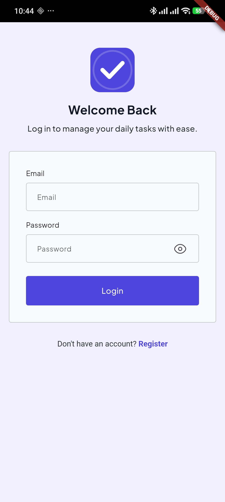
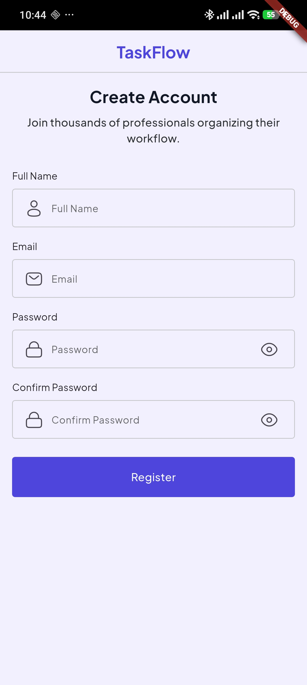
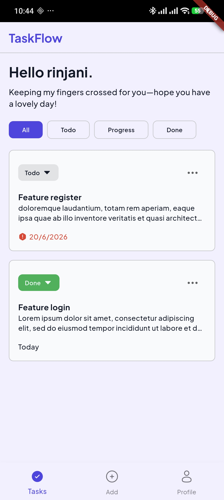
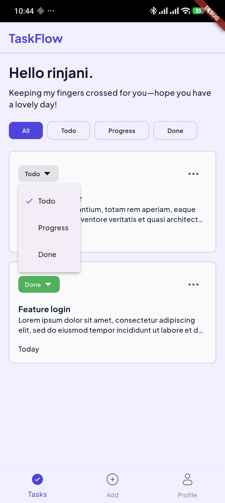
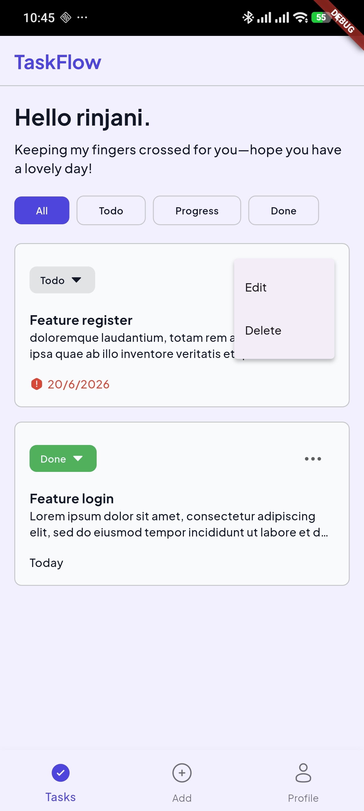
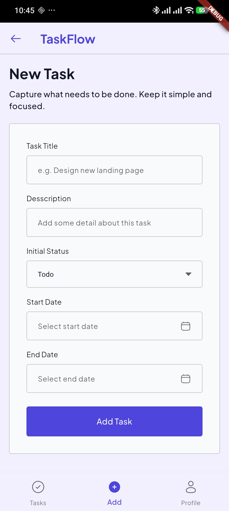
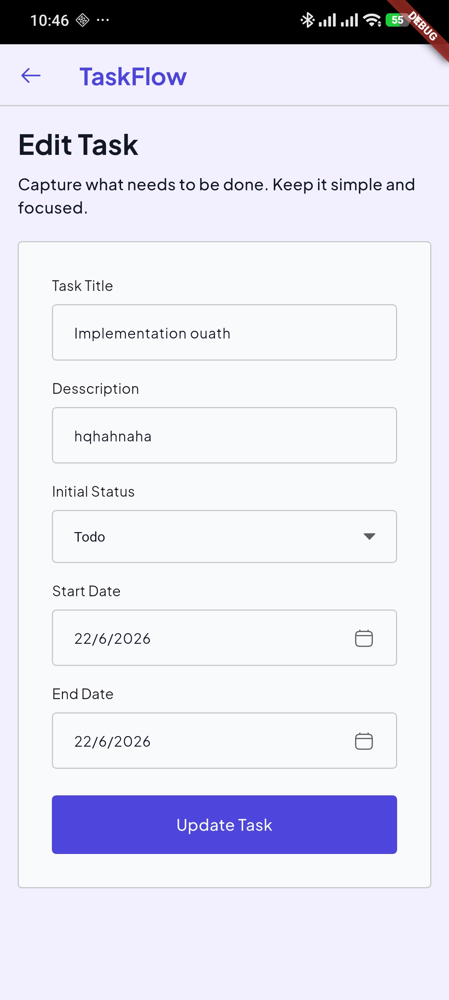
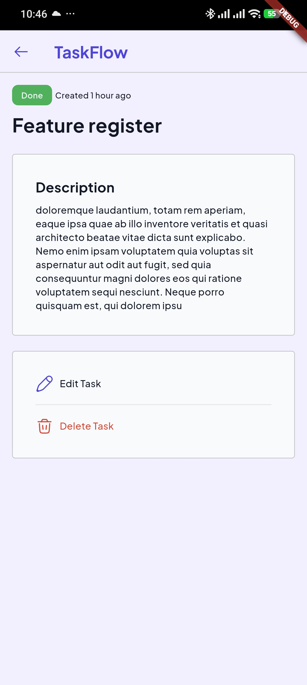
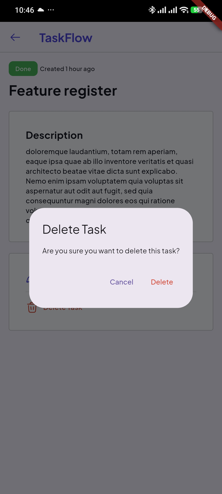
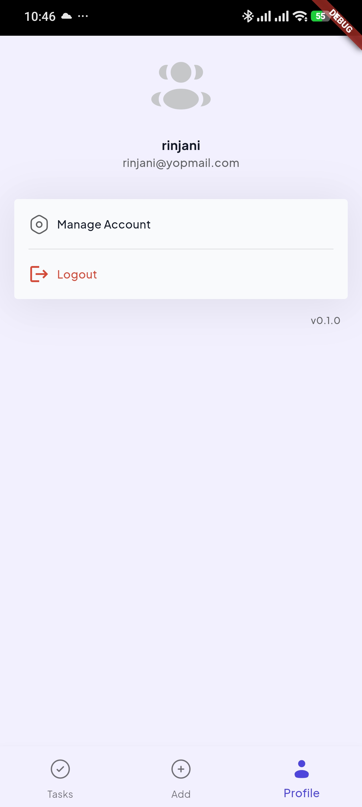

# Task Tracker App

## Cara Menjalankan Project

Prasyarat:
- Flutter SDK v3.41.9
- Android Studio / Xcode atau emulator/device yang terpasang
- Dart v3.11.5

Langkah:
1. Clone repository dan masuk ke folder project:
   - git clone <repo-url>
   - cd task_tracker
2. Install dependency:
   - flutter pub get
3. Jalankan aplikasi:
   - flutter run
4. Build release (opsional):
   - flutter build apk --release

## Penjelasan Arsitektur

Project mengikuti prinsip terstruktur (mirip Clean/Layered architecture) dengan pembagian tanggung jawab:
- Presentation: layar, widget, dan komponen UI.
- State: provider dan state controllers (menggunakan Riverpod) yang menjadi penghubung UI dan domain.
- Domain: entity dan use-case (logika bisnis inti).
- Data: repository, data source (local/remote), dan model mapping.

Organisasi file umumnya bersifat feature-based: setiap fitur memiliki folder sendiri berisi UI, provider, repository, dan model terkait. Ini memudahkan skalabilitas dan pengujian.

## Penjelasan State Management

State management diimplementasikan dengan Riverpod, yaitu:
- Provider: untuk nilai/servis yang tidak berubah.
- StateProvider / StateController: untuk state sederhana yang berubah lokal.
- StateNotifierProvider + StateNotifier: untuk state kompleks dan immutable dengan metode untuk memodifikasi state.
- FutureProvider / StreamProvider: untuk operasi asinkron (fetch data atau stream updates).

Alur umum: UI membaca provider -> memanggil method pada notifier/repository -> notifier memperbarui state -> UI bereaksi terhadap perubahan.

## Alasan Memilih Riverpod

Ringkas alasan memilih Riverpod untuk project ini:
- Bebas dari ketergantungan pada widget tree (decoupled dari BuildContext).
- Lebih aman pada compile-time dan mencegah beberapa kelas bug runtime.
- Skalabel untuk aplikasi besar: provider-family, autoDispose, dan kombinasi provider memudahkan manajemen state feature-wise.
- Performa baik: pembaruan terbatas pada listener yang relevan.

## Screenshot

  
  
  
  
  
  
  
  
  
  

